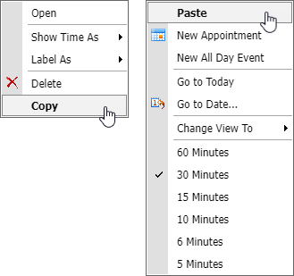

<!-- default badges list -->

[](https://supportcenter.devexpress.com/ticket/details/T164287)
[](https://docs.devexpress.com/GeneralInformation/403183)
<!-- default badges end -->

# Scheduler for ASP.NET Web Forms - How to implement Copy and Paste context menu items for appointments
<!-- run online -->
**[[Run Online]](https://codecentral.devexpress.com/t164287/)**
<!-- run online end -->

This example demonstrates how to implement the copy and paste appointment operations via an appointment context menu. When a user clicks the **Copy** command, the ID of the currently selected appointment is saved to `HiddedField`. When a user clicks the **Paste** command, a custom callback results in copying the selected appointment on the server side.



## Implementation Details

1. The [ASPxScheduler.PopupMenuShowing](https://docs.devexpress.com/AspNet/DevExpress.Web.ASPxScheduler.ASPxScheduler.PopupMenuShowing) event handler adds **Copy** and **Paste** custom items to the context menu displayed for a view and appointment. 

```csharp
protected void ASPxScheduler1_PopupMenuShowing(object sender, DevExpress.Web.ASPxScheduler.PopupMenuShowingEventArgs e) {
    e.Menu.ClientSideEvents.PopUp = "OnClientPopupMenuShowing";

    if(e.Menu.MenuId == DevExpress.XtraScheduler.SchedulerMenuItemId.AppointmentMenu) {
        DevExpress.Web.MenuItem newItemCopy = new DevExpress.Web.MenuItem();
        newItemCopy.Name = "CopyAppointment";
        newItemCopy.Text = "Copy";
        newItemCopy.ItemStyle.Font.Bold = true;
        e.Menu.Items.Add(newItemCopy);
        e.Menu.JSProperties["cpMenuName"] = "AppointmentMenu";
    }
    if(e.Menu.MenuId == DevExpress.XtraScheduler.SchedulerMenuItemId.DefaultMenu) {
        DevExpress.Web.MenuItem newItemPaste = new DevExpress.Web.MenuItem();
        newItemPaste.Name = "PasteAppointment";
        newItemPaste.Text = "Paste";
        newItemPaste.ItemStyle.Font.Bold = true;
        e.Menu.Items.Insert(0, newItemPaste);
        e.Menu.JSProperties["cpMenuName"] = "DefaultMenu";
    }
}
```

2. The context menu's [PopUp](https://docs.devexpress.com/AspNet/DevExpress.Web.MenuClientSideEvents.PopUp) event handler disables **Paste** command when there is no copied appointment.

```jscript
function OnClientPopupMenuShowing(s, e) {
    for (menuItemId in e.item.items) {
        if (e.item.items[menuItemId].name == "PasteAppointment") {
            e.item.items[menuItemId].SetEnabled(document.getElementById("hdCopiedAppointmentID").value != '');
        }
    }
}
```

## Files to Review

* [CustomDataSource.cs](./CS/WebApplication1/CustomDataSource.cs) (VB: [CustomDataSource.vb](./VB/WebApplication1/CustomDataSource.vb))
* [CustomObjects.cs](./CS/WebApplication1/CustomObjects.cs) (VB: [CustomObjects.vb](./VB/WebApplication1/CustomObjects.vb))
* [Default.aspx](./CS/WebApplication1/Default.aspx) (VB: [Default.aspx](./VB/WebApplication1/Default.aspx))
* [Default.aspx.cs](./CS/WebApplication1/Default.aspx.cs) (VB: [Default.aspx.vb](./VB/WebApplication1/Default.aspx.vb))
